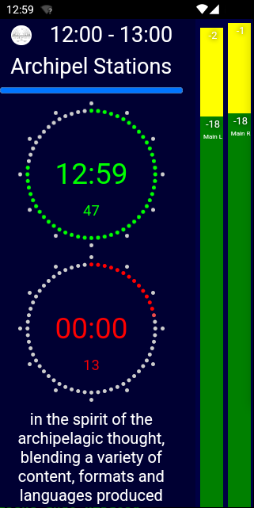

# Piradio Studio Monitor


## Overview

Piradio Studio Monitor is an application for displaying the current radio schedule of 88vier FM and monitoring the peak and loudness levels in the Piradio studio.

## Features

- **Current Schedule Display**: Shows the current 88vier FM radio schedule with broadcast times and program details.
- **Real-time Audio Monitoring**: Monitors the peak and loudness levels in the Piradio studio in real-time.



## Installation


* Install Cordova

```
npm install -g cordova
```

* Install Android Studio

* Set the Java and Android environment variables:

```
export JAVA_HOME=/usr/lib/jvm/java-17-openjdk-amd64/
export ANDROID_HOME=$HOME/milan/Android/Sdk
export PATH=$ANDROID_HOME/cmdline-tools/latest/bin:$PATH
export PATH=$ANDROID_HOME/platform-tools:$ANDROID_HOME/tools:$PATH
export KEYSTORE=android.keystore
```

* Building the Release

* Build the Android release using Cordova:

```
cordova build android --release -- --keystore="$KEYSTORE" --storePassword=YOUR_STORE_PASSWORD --alias=android
```

* Sign the Android App Bundle (AAB) with jarsigner:

```
jarsigner -verbose -sigalg SHA1withRSA -digestalg SHA1 -keystore $KEYSTORE platforms/android/app/build/outputs/bundle/release/app-release.aab android
```
